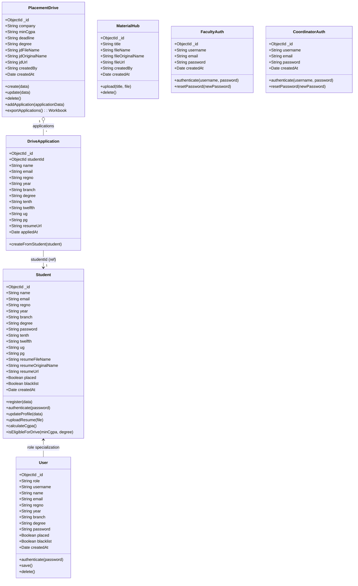

```mermaid
classDiagram
%% Classes and attributes from Mongoose models
class Student {
  +ObjectId _id
  +String name
  +String email
  +String regno
  +String year
  +String branch
  +String degree
  +String password
  +String tenth
  +String twelfth
  +String ug
  +String pg
  +String resumeFileName
  +String resumeOriginalName
  +String resumeUrl
  +Boolean placed
  +Boolean blacklist
  +Date createdAt
  +register(data)
  +authenticate(password)
  +updateProfile(data)
  +uploadResume(file)
  +calculateCgpa()
  +isEligibleForDrive(minCgpa, degree)
}

class PlacementDrive {
  +ObjectId _id
  +String company
  +String minCgpa
  +String deadline
  +String degree
  +String jdFileName
  +String jdOriginalName
  +String jdUrl
  +String createdBy
  +Date createdAt
  +create(data)
  +update(data)
  +delete()
  +addApplication(applicationData)
  +exportApplications() : Workbook
}

class DriveApplication {
  +ObjectId _id
  +ObjectId studentId
  +String name
  +String email
  +String regno
  +String year
  +String branch
  +String degree
  +String tenth
  +String twelfth
  +String ug
  +String pg
  +String resumeUrl
  +Date appliedAt
  +createFromStudent(student)
}

class MaterialHub {
  +ObjectId _id
  +String title
  +String fileName
  +String fileOriginalName
  +String fileUrl
  +String createdBy
  +Date createdAt
  +upload(title, file)
  +delete()
}

class FacultyAuth {
  +ObjectId _id
  +String username
  +String email
  +String password
  +Date createdAt
  +authenticate(username, password)
  +resetPassword(newPassword)
}

class CoordinatorAuth {
  +ObjectId _id
  +String username
  +String email
  +String password
  +Date createdAt
  +authenticate(username, password)
  +resetPassword(newPassword)
}

class User {
  +ObjectId _id
  +String role
  +String username
  +String name
  +String email
  +String regno
  +String year
  +String branch
  +String degree
  +String password
  +Boolean placed
  +Boolean blacklist
  +Date createdAt
  +authenticate(password)
  +save()
  +delete()
}

%% Relationships
PlacementDrive "1" o-- "*" DriveApplication : applications
DriveApplication --> "1" Student : studentId (ref)
Student <-- User : role specialization

%% Notes
%% - `User` is a general model in the codebase; `Student` is a separate collection with similar fields.
```
